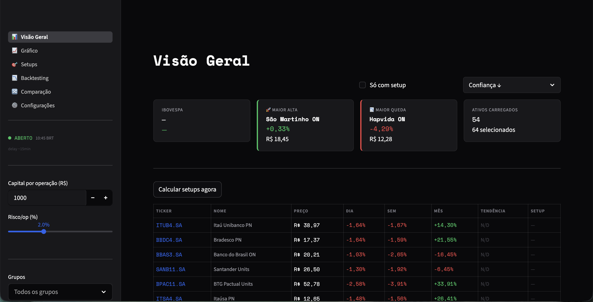
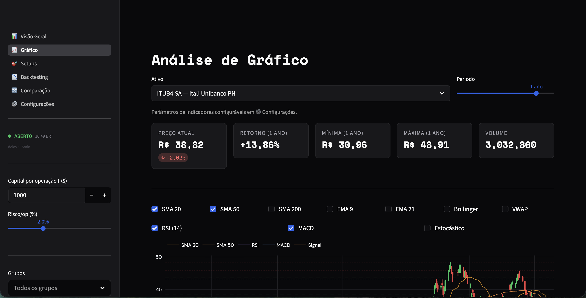
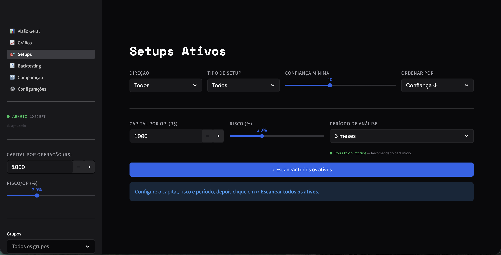
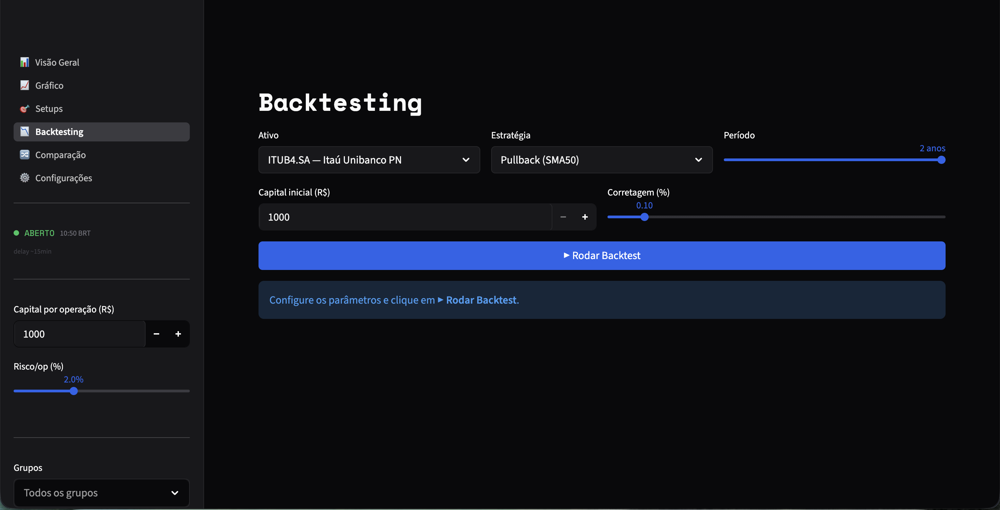
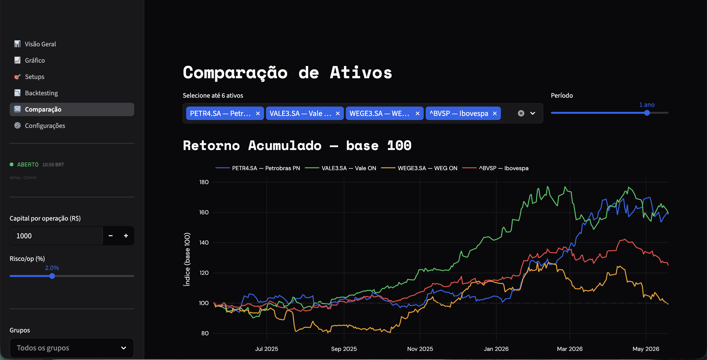
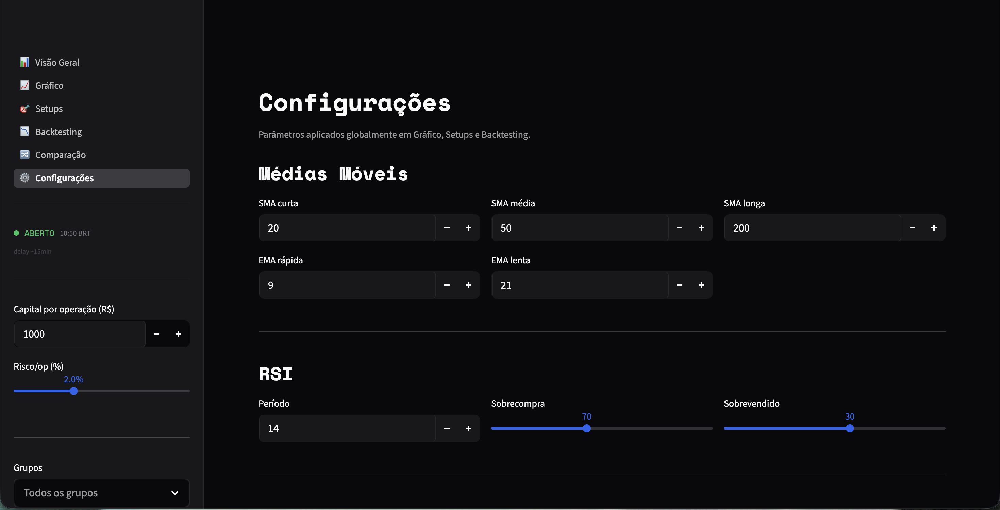
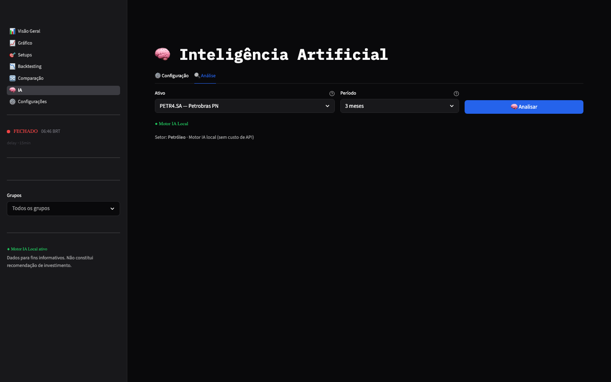
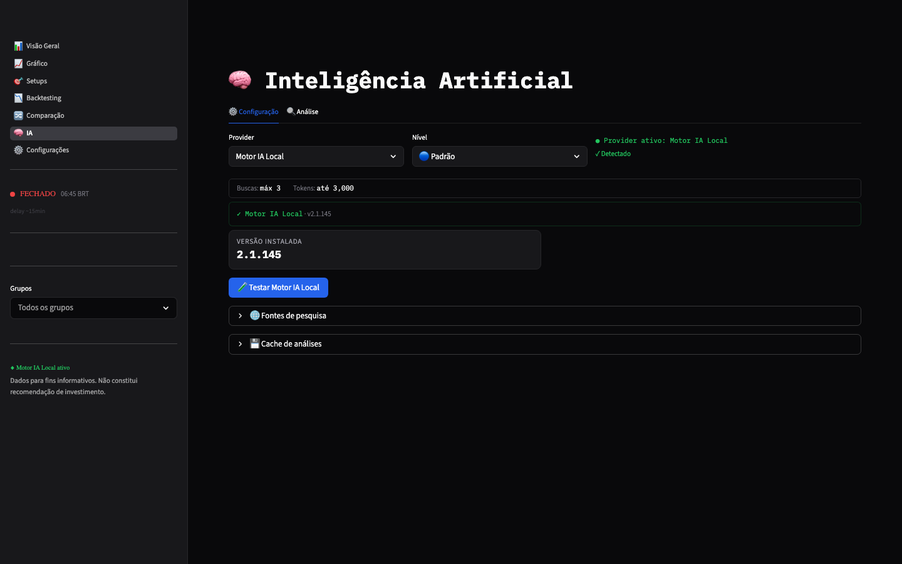

# BOLSA.BR — Análise Técnica de Ações da B3

Sistema de análise técnica e geração de setups de trade para ações da B3,
construído em Python com interface web interativa via Streamlit.


---

## Screenshots

### Visão Geral — cotações, tendências e setups


### Gráfico — candlestick com indicadores sobrepostos


### Setups — scanner com sizing e R/R automáticos


### Backtesting — equity curve vs buy & hold


### Comparação — retorno normalizado e correlação


### Configurações — parâmetros globais de indicadores


### Análise IA — análise fundamentalista e técnica gerada por IA


### Configuração IA — escolha de provedor, modelo e preset


---

## Funcionalidades

- **Visão Geral** — cotações de ~80 ações da B3 com tendência em 3 horizontes, badges LONG/SHORT e sparklines
- **Gráfico** — candlestick interativo com overlays de médias (SMA/EMA), Bollinger Bands, VWAP, RSI, MACD, Estocástico e setup sobreposto
- **Setups** — scanner paralelo com 4 padrões (Pullback, Rompimento, Reversão, Cruzamento), sizing automático e relação risco/retorno
- **Backtesting** — teste histórico das 4 estratégias com equity curve, Sharpe, drawdown e tabela de trades
- **Comparação** — retorno normalizado (base 100) e heatmap de correlação entre até 6 ativos
- **Configurações** — parâmetros globais de médias móveis, RSI, MACD e ATR aplicados em todas as páginas
- **Análise IA** — análise técnica e fundamentalista gerada por IA com contexto macroeconômico, recomendações de analistas e dados de mercado em tempo real

---

## Instalação

```bash
git clone https://github.com/seu-usuario/b3-analytics.git  # substitua pela URL do seu fork
cd b3-analytics
python -m venv .venv
source .venv/bin/activate        # macOS/Linux
# .venv\Scripts\activate         # Windows
pip install -e ".[dev,test]"
streamlit run app.py
```

O dashboard abrirá em `http://localhost:8501`.

---

## Stack

[Streamlit](https://streamlit.io/) · [Plotly](https://plotly.com/python/) · [yfinance](https://github.com/ranaroussi/yfinance) · [backtesting.py](https://kernc.github.io/backtesting.py/) · [SciPy](https://scipy.org/) · [Anthropic API](https://www.anthropic.com/) · OpenAI API · Google Gemini

**Fonte de dados:** Yahoo Finance · delay ~15 minutos · sem necessidade de chave de API para funcionalidades base

---

## Observações

> **Delay de ~15 minutos:** O Yahoo Finance gratuito não fornece dados em tempo real durante o pregão.

> **Cache de 5 minutos:** Os dados são cacheados localmente para reduzir requisições à API.

> **Sem chaves de API:** O projeto funciona inteiramente com o tier gratuito do Yahoo Finance para todas as funcionalidades base.

> **Análise IA — dois modos:**
> - **Motor IA Local** — usa o [Claude Code CLI](https://claude.ai/code) instalado localmente, sem custo adicional e sem necessidade de chave de API.
> - **APIs remotas** — Anthropic, OpenAI (`OPENAI_API_KEY`) e Google Gemini (`GOOGLE_API_KEY`). As chaves podem vir de variável de ambiente ou ser salvas em `~/.b3analytics/config.json`, nunca no repositório. Presets disponíveis: Econômico, Padrão e Completo. Cache de resultados configurável de 30 minutos a 24 horas.

---

## Qualidade e testes

```bash
pip install -e ".[dev,test]"
pytest
ruff check .
# E2E opcional no PowerShell:
$env:B3_RUN_E2E="1"; pytest tests/test_e2e.py
```

---

## Solução de problemas

- **`ModuleNotFoundError` ao rodar testes:** execute `pip install -e ".[dev,test]"` no ambiente virtual ativo.
- **Playwright sem navegador instalado:** execute `python -m playwright install chromium`.
- **E2E instável/lento:** os testes de browser são opcionais e exigem `B3_RUN_E2E=1`; o `pytest` padrão cobre testes unitários, integração e segurança.
- **Tela sem dados:** confirme a conexão com a internet e tente novamente; a fonte base é Yahoo Finance e pode falhar ou atrasar.
- **IA remota não funciona:** configure a chave do provider na tela de IA ou use `ANTHROPIC_API_KEY`, `OPENAI_API_KEY` ou `GOOGLE_API_KEY`.

---

## Aviso Legal

> As informações exibidas têm caráter exclusivamente informativo e educacional.
> Nenhum conteúdo deste sistema constitui recomendação de investimento, compra ou
> venda de ativos. Dados com delay de aproximadamente 15 minutos. Análise técnica
> não garante resultados futuros. Invista com responsabilidade.

---

## Licença

MIT
